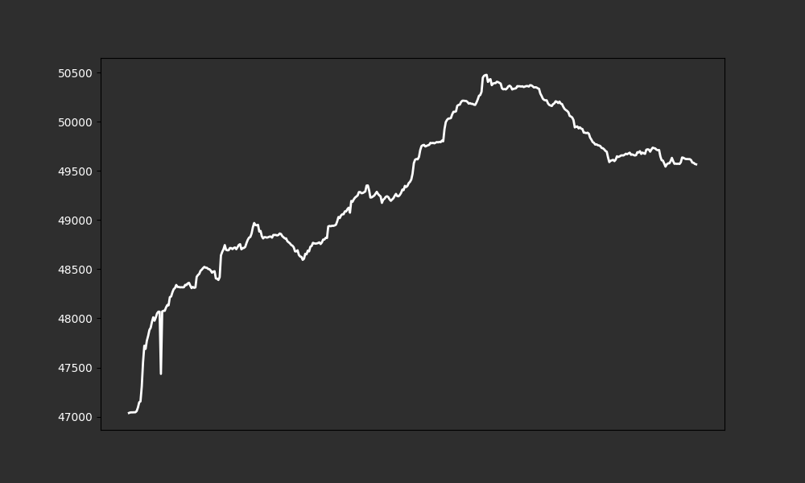

# Delegators Count (APT $9.15)  
Total Delegators: 47092 
Total APT Delegated: 306628889  
  
**OP received for the third airdrop on 18.09.2023 (price of OP was $1.368):** 
Addresses received drop: 31870 
Average amount received: 609.08 ($833.22) 
Median amount received: 238.49 ($326.26) 
Total drop distribution: 19411313 ($26554676.18)  
If Aptos Foundation spent the same amount for the delegation airdrop as Optimism Foundation team ($26554676.18),they will spend 2902150.40 APT for this airdrop. 
With this logic, every APT delegate will receive on average: 61.63 APT ($563.89) 
